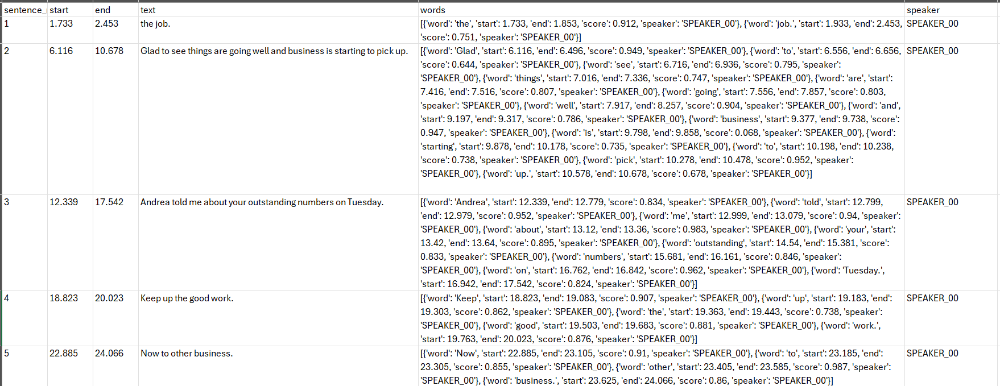

# WhisperX Transcription + Diarization Audio Processing for Researchers
This repository contains a Jupyter notebook for qualitative researchers to transcribe, diarize speakers, and convert audio or video files into various text formats (csv, txt, json, & vtt). The notebook uses advanced transcription and diarization capabilities provided by Whisper and WhisperX, as well as [pyannote speaker-diarization-3.1](https://huggingface.co/pyannote/speaker-diarization-3.1) and [segmentation-3.0](https://huggingface.co/pyannote/segmentation-3.0) libraries from Hugging Face*.  

*A free [Hugging Face](https://huggingface.co/docs/hub/en/security-tokens) token is required specifically for the diarization aspects. The code will not work without it.
 
 The code is derived and built from the following [Medium article](https://towardsdatascience.com/unlock-the-power-of-audio-data-advanced-transcription-and-diarization-with-whisper-whisperx-and-ed9424307281)

To be clear, I am a VERY novice programmer, and much of this work has been done in collaboration with ChatGPT. I am a PhD student with a focus on equity in STEM education as well as educational technology, and I am always in need of better ways of transcribing the tons of audio/video data that we collect. I have been doing a lot of work using natural language processing tools for text analytics and pattern detection (Laura K. Nelson, Computational Grounded Theory) recently so I have fallen down the rabbit hole of producing Jupyter notebooks and decided to make one for WhisperX transcription. I am also a gamer so I happen to have an Nvidia 3090 GPU on my home pc as well as a 4090 gpu in our research lab. The tools I used before were difficult to work with and didn't output in the way that I wanted. So one of my side projects has been trying to redesign the code base WhisperX code found at the site above, so that it is much more useful for generating transcriptions for researchers like myself and the others I work with. I'm certain there are still improvements to be made, but it has worked for us thus far.

This means: 
1. I wanted the ability to do batch transcriptions of audio files found in multiple subdirectories. 
2. I wanted to take advantage of WhisperX's word level time stamping. 
3. Utilize pyannote's speaker diarization capabilities. 
4. Generate csv, txt, json, and vtt files for each audio file transcribe. 
5. Ability to anonymize specific names and places during transcription. 

### Example CSV output 


## What This Code Does

1. **Device and Configuration Setup**: Sets up the device (GPU or CPU) and other configuration variables like batch size, compute type, and model type.
2. **Library Imports**: Imports necessary libraries including PyTorch, WhisperX, and others for handling audio files, text processing, and file I/O.
3. **Path and File Type Setup**: Defines paths to your audio files and output directories and specifies the types of audio files to process.
4. **Pseudonym Loading**: Loads a CSV file containing pseudonyms for anonymizing transcripts.
5. **Audio Processing Functions**: Includes functions to find audio files, get file modification dates, anonymize text, convert segments to different formats, and process each audio file.
6. **Main Function Execution**: Finds all audio files in the specified directory, processes them, and saves the transcripts in multiple formats (CSV, TXT, JSON, VTT).

## How to Use This Repo

WhisperX documentation found here: https://github.com/m-bain/whisperX

### A. Install General Software
================================================
1. Install Git
2. Install FFMPEG and add to PATH
3. Install Anaconda 

### B. Set Up Conda Environment
================================================   
1. Create Conda environment
```sh
conda create -n whisperxtranscription-env python=3.10
conda activate whisperxtranscription-env
```
2. Install PyTorch https://pytorch.org/get-started/locally/ 
```sh
pip install numpy==1.26.3 torch==2.3.0 torchvision==0.18.0 torchaudio==2.3.0 --index-url https://download.pytorch.org/whl/cu121
```

3. Install WhisperX repository and additional packages
```sh
pip install whisperx speechbrain jupyter ipywidgets charset-normalizer pandas nltk plotly matplotlib webvtt-py pypi-json srt python-dotenv
```

4. Create .env file at the same level as this notebook file with the following line
```sh
HF_TOKEN="REPLACEWITHHUGGINGFACETOKENHERE"
```
### C. To Set Up NVIDIA GPU
=================================================
1. Install Visual Studio Community https://visualstudio.microsoft.com/downloads/
2. Install NVIDIA CUDA Toolkit 12.1 https://developer.nvidia.com/cuda-12-1-0-download-archive 

#### Check PyTorch and CUDA installation
```sh
import torch
print(torch.__version__)
print(torch.cuda.is_available())
print(torch.cuda.get_device_name(0))
```

### D. Setup and Use Jupyter Notebook
=================================================
#### Audio File Types
Update the file type(s) of your audio files:
```sh
file_type1 = '.wav'
file_type2 = '.mp3'
file_type3 = '.ogg'
```
#### Prepare Pseudonyms CSV
Pseudonyms CSV: Ensure you have a CSV file named pseudonyms.csv in the data directory. This file should contain columns name and pseudonym for anonymizing the transcripts.

#### Execute the set-up code
The main function finds all audio files in the specified directory, processes them, and saves the transcripts. To run the code, simply execute the script.

#### Execute the transcription and diarization functions
### Check the Outputs
Output Files:
The transcripts will be saved in the specified output directory in multiple formats: CSV, TXT, JSON, and VTT

## Conclusion
This code is designed to make it easy to process and transcribe large batches of audio or video files while ensuring anonymity through pseudonymization. Happy transcribing!# WhisperXTranscription4Researchers
